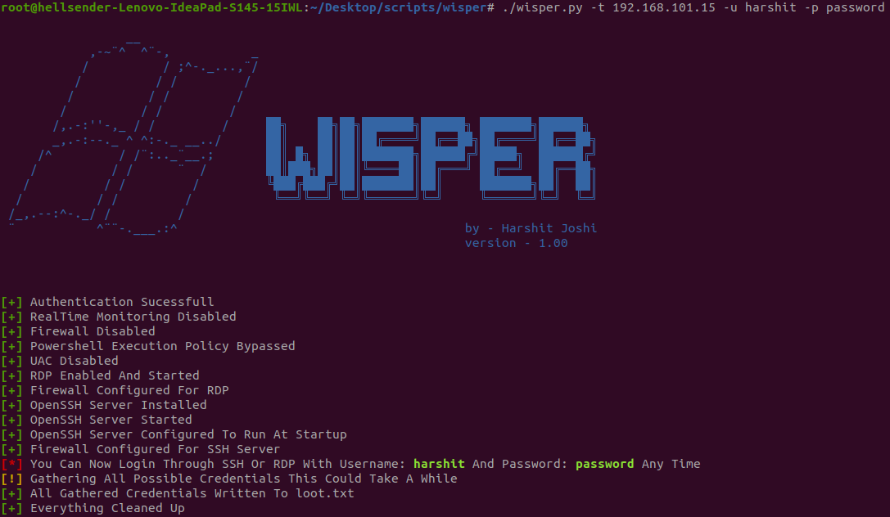
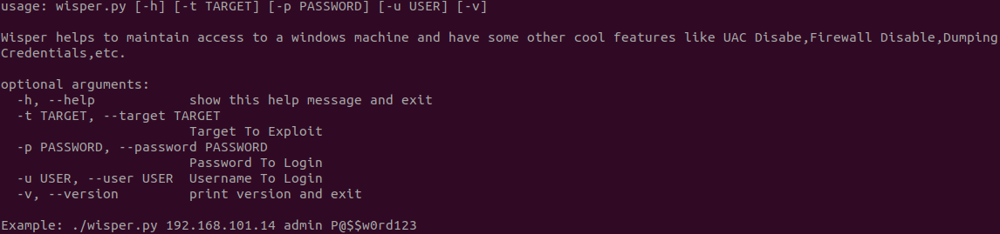

# Windows Persistence

[](https://www.python.org/)
[](https://www.microsoft.com/en-in/windows)
[](https://github.com/ellerbrock/open-source-badges/)
[](https://github.com/Naereen/StrapDown.js/blob/master/LICENSE)
```ruby
                 __                 
            ,-~¨^  ^¨-,           _
           /          / ;^-._...,¨/ 
          /          / /         /  
         /          / /         /   
        /          / /         /    
       /,.-:''-,_ / /         /     ██╗    ██╗██╗███████╗██████╗ ███████╗██████╗ 
       _,.-:--._ ^ ^:-._ __../      ██║    ██║██║██╔════╝██╔══██╗██╔════╝██╔══██╗
     /^         / /¨:.._¨__.;       ██║ █╗ ██║██║███████╗██████╔╝█████╗  ██████╔╝
    /          / /      ¨  /        ██║███╗██║██║╚════██║██╔═══╝ ██╔══╝  ██╔══██╗
   /          / /         /         ╚███╔███╔╝██║███████║██║     ███████╗██║  ██║
  /          / /         /           ╚══╝╚══╝ ╚═╝╚══════╝╚═╝     ╚══════╝╚═╝  ╚═╝
 /_,.--:^-._/ /         /                                                        
 ¨           ^¨¨-.___.:^                                       by - Harshit Joshi
                                                               version - 1.00
                              
```

# Introduction

WisPer helps to automate the task of preparing a windows system for maintaining access of a hacker using ssh and rdp with some additions functionality like dumping credentials,UAC bypass,disabling firewall,etc.



# Help

 > -t or --target     ➤ Target System IPv4 Address \
 > -u or --user       ➤  Username To Authenticate With \
 > -p or --password   ➤ Password To Authenticate With \
 > -v or --version    ➤ To Show Current WisPer Version \
 > -h or --help       ➤ To Show Below Message
 
 
